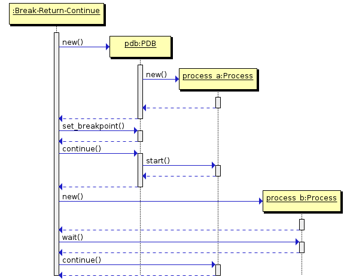

snakerace
=========

Detect Race conditions in Python

You have a python program, which is using a module, you would like to detect
race conditions in that module. These tools could help you to discover these
race conditions.

# Break - Run - Continue

In this scenario, Process A is stopped at a specific breakpoint, Process B
is executed and completed, and after this Process A is Continued.

To see an example, look at the [example script](examples/exercise.sh)
